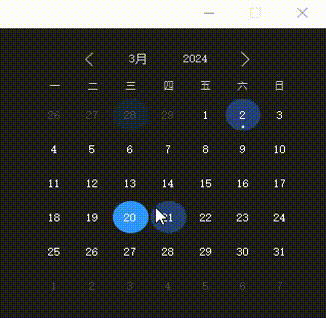
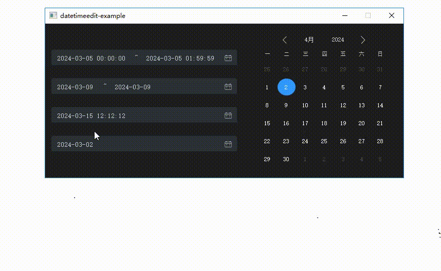
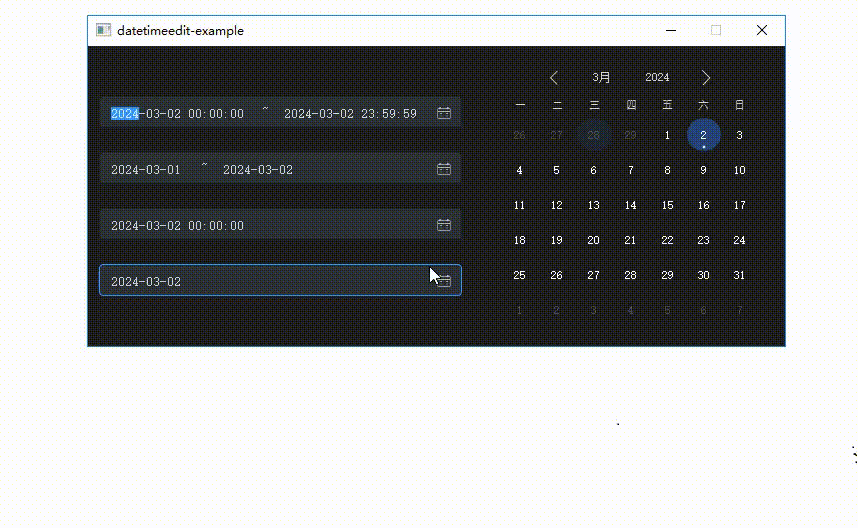

# datetimeedit

`datetimeedit`是一个基于`Qt` + `阿里巴巴矢量图标库`实现的跨平台日历日期编辑控件库，提供了易用的接口，具备为实际项目所应用的能力。

大致采用`Google`  C++开源项目编码规范。

## ✨特性

- 跨平台（Linux/Windows/MacOS）
- 日期选择器、日期时间选择器、日期范围选择器、时间日期范围选择器
- 日历显示，支持模式（无选中、单选、多选、范围选）
- 范围选择器双击某个日期，开始和结束日期将变为同一日期
- 范围选择器开始日期大于结束日期时，将自动调整日期
- 日期时间范围选择器日期相等时，若开始时间大于结束时间，将会自动调整时间为00:00:00或23:59:59，并标红编辑框，1s后恢复
- 日历支持前后100年日期选择，并以小圆点标记当天日期（动态刷新）
- 日历日期、年、月页面切换时，具备属性动画效果
- 日期编辑控件输入框不仅支持日历选择器选择，还支持手动编辑或滚动编辑

## 🛠️构建

```shell
mkdir build
cd build
cmake ..
cmake --build .
```

## :pager: 界面

1. **日历**

   

2. **日期、时间选择器**



3. **日期、时间范围选择器**



## :bookmark: 使用

1. 主程序链接`datetimeedit` 库，并将生成的`datetimeedit动态库`，拷贝至主程序运行目录
2. 引入include目录下的头文件
3. 参考example目录使用流程

## :email: ​联系

- **Qt技术交流群** : `884099523`， 欢迎进群交流
- **邮箱**: `1085080350@qq.com`

